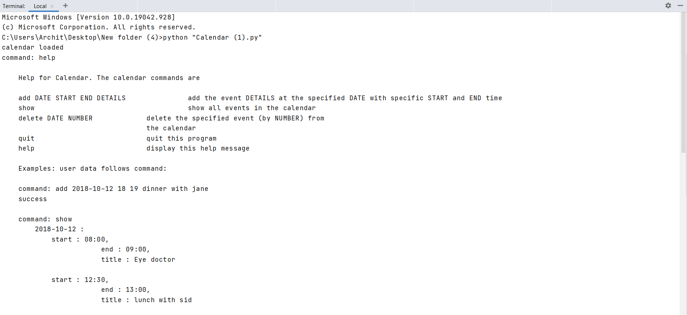
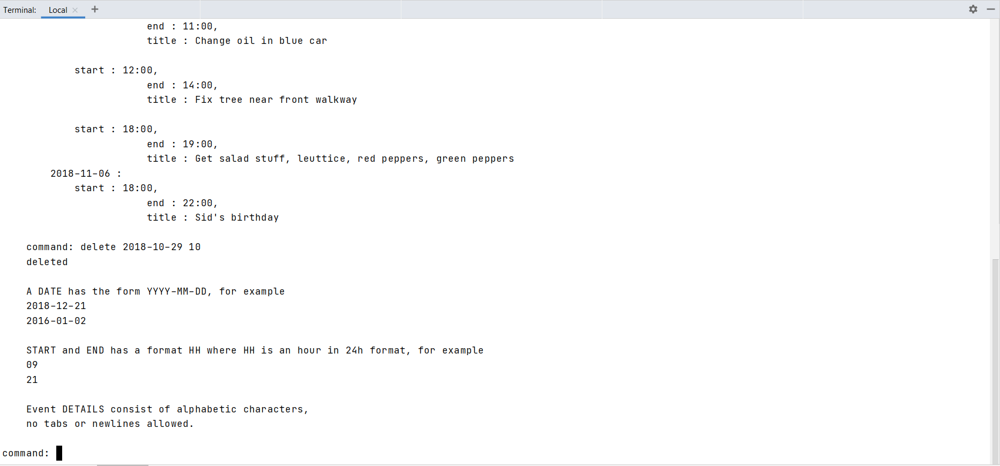
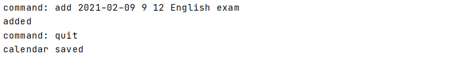
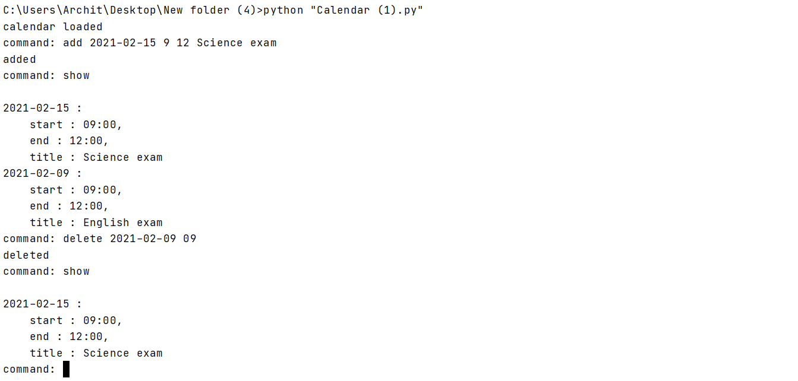
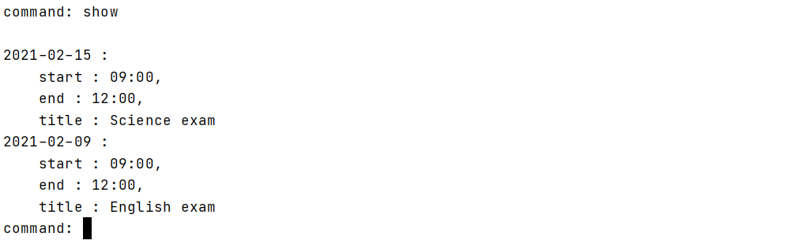
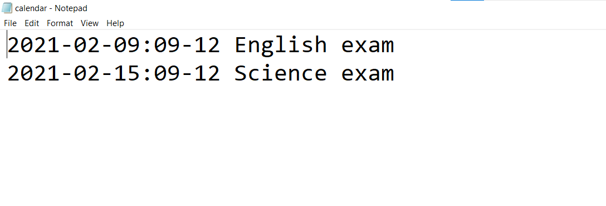

# Calendar 
*Keep track of your submission dates!*

### Decription
Calendar as the name suggests it helps you to mark your important work and helps to keep track of all the things especially your schedule.
## Important commands
1. help:
You can use the ```help``` command to see the use of this program.


***
2. add:
If you want to add (which infact you want) some thing in your calendar then just use the ```add``` command.  
Syntax:
```add date start_time end_time event_description```

***
3. delete:
If you want to delete anything from your calendar the use ```delete``` command.

***
4. show:
If you want to see your calendar then you just have to use ```show``` command.

***
5. quit:
If you want to quit the program just enter ```quit``` command.
***
### Calendar Saved
When you used the quit command the program automatically saved your calendar.  
the next time you will run the program you will be able to view your own calnedar agin just by using the ```show ``` show command.

***
If you are curious that how many functions are used to make this program then just dive deep into the code.
*** Usage
```bash
    python Calendar.py
```
